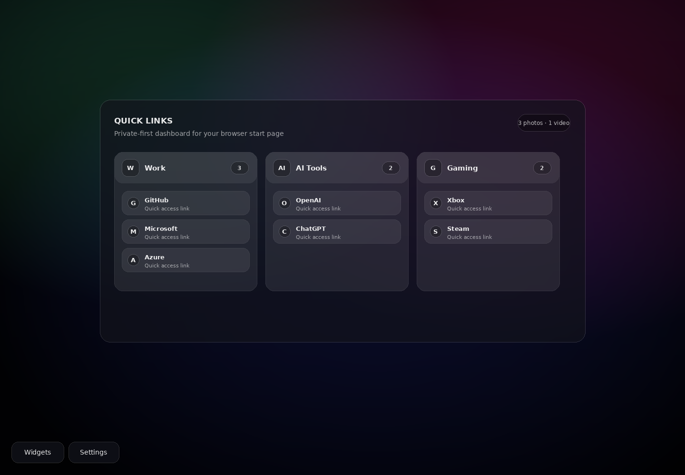
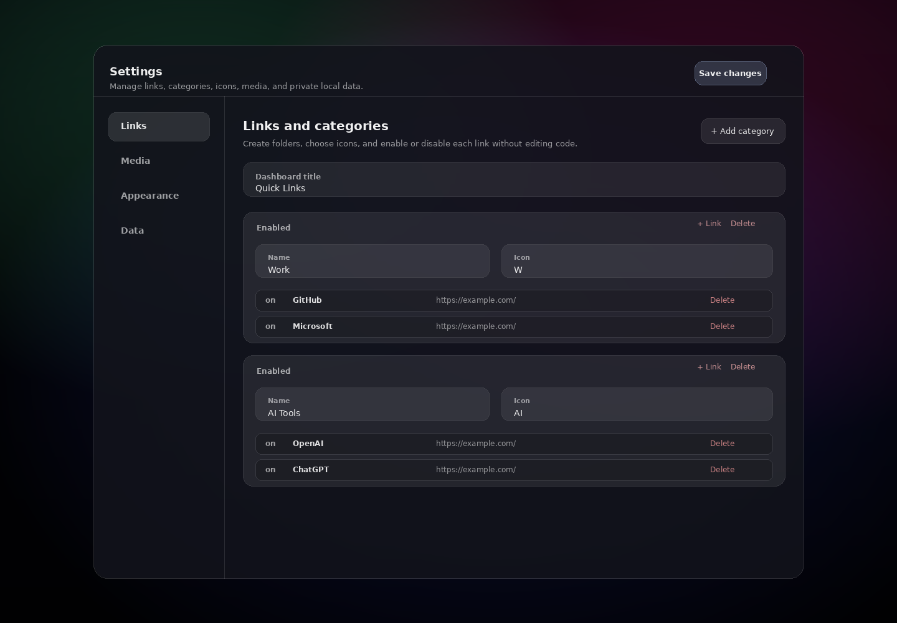
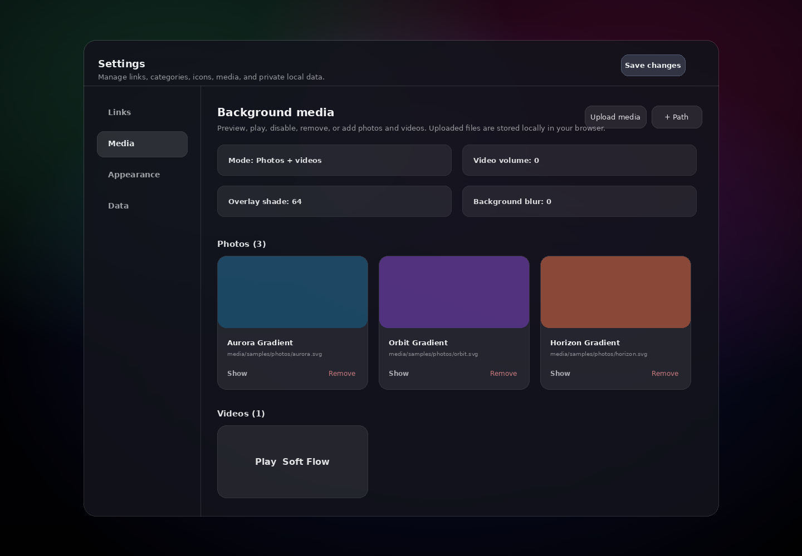

# NeTab

**NeTab** is a private-first Chrome new tab dashboard. It gives you a beautiful start page with grouped quick links, random photo/video backgrounds, embedded widgets, and a full in-browser settings panel for editing everything without touching code.

The project is intentionally simple: no framework, no build step, no tracking, and no backend. It is just a Manifest V3 Chrome Extension made with HTML, CSS, and JavaScript.



## What it does

NeTab replaces Chrome's default new tab page with a clean glass-style dashboard. You can organize links into categories, choose category icons, use automatic favicons or custom link icons, and open each folder with one click. The background changes randomly on every new tab and can use photos, videos, sample media, packaged local media, or files uploaded through the Settings panel.

The Settings panel is the main control center. It lets you add, remove, disable, preview, and play media; tune video volume, shade, blur, and scale; add or remove link categories; edit links; choose icons; import/export the whole configuration; reload local ignored JSON files; and reset to safe public defaults.





## Privacy-first setup

NeTab is designed so the public repository can stay clean while your personal setup stays local.

Public files:

- `data/links.json` contains safe example links such as GitHub, Microsoft, Xbox, OpenAI, and Steam.
- `data/media.json` contains small sample media entries.
- `media/samples/` contains curated sample wallpapers/video for convenience.
- `.env.example` documents the optional local environment workflow.

Private/local files ignored by Git:

- `.env`
- `data/links.local.json`
- `data/media.local.json`
- `media/photos/*`
- `media/videos/*`

When NeTab loads, it tries local private JSON first, then falls back to public defaults:

```text
data/links.local.json  ->  data/links.json
data/media.local.json  ->  data/media.json
```

The browser Settings panel stores edits in `chrome.storage.local`, and uploaded media files are stored locally in IndexedDB. Nothing is sent to a server.

## Install locally in Chrome

1. Open Chrome and go to `chrome://extensions/`.
2. Enable **Developer mode**.
3. Click **Load unpacked**.
4. Select this project folder.
5. Open a new tab.

## Customize links

Use the Settings button in the bottom-left corner, or edit `data/links.local.json` for a private file-based setup.

Example:

```json
{
  "title": "Quick Links",
  "groups": [
    {
      "id": "work",
      "name": "Work",
      "icon": "💼",
      "enabled": true,
      "links": [
        {
          "id": "github",
          "label": "GitHub",
          "note": "Code hosting",
          "url": "https://github.com/",
          "enabled": true
        }
      ]
    }
  ]
}
```

## Customize media

You have three options:

1. Use **Settings → Media → Upload media**. This stores media locally inside the browser.
2. Put private files under `media/photos/` or `media/videos/`, then add them from Settings with **Add packaged path**.
3. Edit `data/media.local.json` with private paths.

Example:

```json
{
  "settings": {
    "mode": "mixed",
    "videoVolume": 0,
    "shadeStrength": 64,
    "blur": 0,
    "scale": 102
  },
  "photos": [
    {
      "id": "my-wallpaper",
      "name": "My Wallpaper",
      "path": "media/photos/wallpaper.jpg",
      "enabled": true
    }
  ],
  "videos": [
    {
      "id": "my-video",
      "name": "My Video",
      "path": "media/videos/background.webm",
      "enabled": true
    }
  ]
}
```

## Optional `.env` workflow

Copy `.env.example` to `.env`, put JSON into `NETAB_LINKS_JSON` or `NETAB_MEDIA_JSON`, then run:

```bash
npm run sync:env
```

This writes ignored local files:

```text
data/links.local.json
data/media.local.json
```

## Test

```bash
npm test
```

The test validates the extension manifest, public JSON files, required files, and JavaScript syntax.

## GitHub Actions CI

The repository includes `.github/workflows/ci.yml`. It runs automatically on pushes and pull requests to `main`:

```text
checkout -> setup Node.js 22 -> npm test
```

## Create a public release ZIP

```bash
npm run zip
```

This creates:

```text
release/netab-extension.zip
```

The release ZIP excludes `.env`, `data/*.local.json`, `node_modules`, personal `media/photos/*`, and personal `media/videos/*`.

## Project structure

```text
.
├── .github/workflows/ci.yml
├── data/
│   ├── links.json
│   ├── links.example.json
│   ├── media.json
│   └── media.example.json
├── docs/screenshots/
├── media/samples/
├── scripts/
│   ├── sync-env.mjs
│   ├── validate.mjs
│   └── zip-release.mjs
├── manifest.json
├── newtab.html
├── newtab.css
├── newtab.js
├── package.json
└── README.md
```

## Publishing safely

Before making the repository public, confirm that private files are not tracked:

```bash
git status --short
git check-ignore -v .env data/links.local.json data/media.local.json media/photos/example.jpg media/videos/example.mp4
```

If private links or media were committed in the past, `.gitignore` is not enough. You must rewrite history before publishing. See the command block in the project handoff notes or use a fresh clean repository with a single new initial commit.
